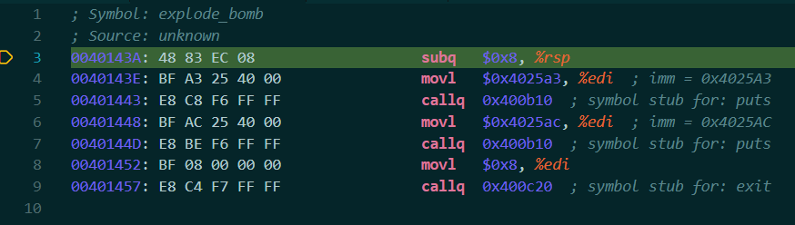

# LAB2 BombLab
## 准备阶段
- 学习 CMU 15-213 （2015Fall版本即可）的这些课程：Machine Prog: Basics, Machine Prog: Control, Machine Prog: Procedures，参考这三节课的课件。或者看 CSAPP 第二章。它们会从0开始教你 X86-64 汇编语言的语法，以及 c 语言的 calling convections。
- 实验环境：Windows11 系统的 WSL2 + VSCODE。
- 去官网 https://csapp.cs.cmu.edu/3e/labs.html 下载实验文件`Self-Study Handout`到 LINUX 机器（比如WSL2），然后解压。此外，建议下载`Writeup`，以得知这个实验要干什么，并获得一些实验提示。
- 核心文件是可执行文件`bomb`，需要对它反汇编。
- bomb.c 可以查看程序的大致结构，但是所调用函数的具体实现是没有的，15213的实验课件里面提到"Source file just makes fun of you."。下面是每个 phase 的结构。bomblab 分为六个 phase（可理解为6个函数），每个 phase 读取一行字符串输入，然后做一些未知的事情，如果你输入的字符串是正确的，那么就会调用 phase_defused 解除炸弹。
```c
input = read_line();             /* Get input                   */
phase_1(input);                  /* Run the phase               */
phase_defused();                 /* Drat!  They figured it out! */
```
- 根据Writeup的提示，在实验目录运行命令`objdump -d bomb`获得`bomb`的汇编代码，检索`phase_1`的代码段，发现里面有个`call 40143a <explode_bomb>`，这是炸弹爆炸的调用。它前面有个`je`命令，如果`je`条件跳转的条件满足，它就会跳过炸弹爆炸的代码。所以，我们的输入需要使得代码能跳过`call 40143a <explode_bomb>`。
```asm
0000000000400ee0 <phase_1>:
  400ee0:	48 83 ec 08          	sub    $0x8,%rsp
  400ee4:	be 00 24 40 00       	mov    $0x402400,%esi
  400ee9:	e8 4a 04 00 00       	call   401338 <strings_not_equal>
  400eee:	85 c0                	test   %eax,%eax
  400ef0:	74 05                	je     400ef7 <phase_1+0x17>
  400ef2:	e8 43 05 00 00       	call   40143a <explode_bomb>
  400ef7:	48 83 c4 08          	add    $0x8,%rsp
  400efb:	c3                   	ret
```
- 根据WriteUp，每个phase需要一行字符串输入。你可以运行bomb程序在命令行根据程序提示逐行输入，也可以从文本文件中直接读取。在实验目录中创建文件`answer.txt`, 执行下列命令，程序将 **逐行** 读取文件作为每个 phase 的输入字符串。
```bash
./bomb answer.txt
```
## 图形化调试工具
- 本实验需要使用调试工具。由于我的 WSL 配置了 clangd + lldb 环境，所以所以本实验我直接使用 lldb 作为调试工具，而未使用 gdb。与 gdb 相比，lldb 的调试命令更加直观。
- 其中，lldb 在函数开头打断点的语法是`breakpoint set --name {function_name}`。
- vscode 可以为调试提供图形化界面。在bomblab的实验目录中，创建一个`.vscode/launch.json`，写入下列内容：
```json
{
    "version": "0.2.0",
    "configurations": [
        {
            "type": "lldb",
            "request": "launch",
            "name": "Debug",
            "program": "bomb",
            "args": ["answer.txt"],
            "initCommands": [
                "breakpoint set --name main"
                // "breakpoint set --name phase_1",
                "breakpoint set --name explode_bomb"
             ]
        } 
    ]
} 
```
- 目前的实验目录结构如下：
```
.
├── .vscode
│   └── launch.json
├── README
├── answer.txt
├── bomb
└── bomb.c
```
- （看下图）在实验目录，点击 vscode 左侧边栏的运行和调试，然后点击左上方的绿色运行按钮(在Debug旁边)，将会打开一个窗口，显示 main 函数的汇编代码，并且程序执行到`cmpl   $0x1, %edi`。与此同时，界面右上方有一个浮动工具栏，显示了 播放按钮▶，单步执行，单步跳入，单步跳出按钮和终止调试按钮。由此，本实验的调试方式变得和一般程序的图形化界面调试类似了，只不过一般程序我们调试的是 C/Java/Python 等高级语言，这里我们调试的是汇编代码。除了初始在`launch.json`文件中设置断点外，程序执行过程中，可直接通过图形化界面的方式，在汇编代码的某一行左侧通过点击设置断点。

- 在程序执行到 call 指令时，点击单步跳入⬇，效果和 C 语言程序执行时跳入某个被调用的函数体内部是一致的。
- 调试控制台可以在下图底部红框处输入调试命令，比如打印寄存器的值：`print $rsp`，读取内存`M[%rsp + 8]`：`memory read $rsp+8`。此外，图片左上方的`变量`栏可以选择`Registers`查看`%rax, %rbx...`等寄存器的数值。

- 你可以使用调试命令修改寄存器的值，比如：当程序即将单步运行到`call 40143a <explode_bomb>`，你可以修改%rip寄存器的值：`register write $rip [希望跳转的汇编代码地址]`，使得程序跳转到不会爆炸的指令行。
- 此外，为了 **防止炸弹爆炸** ，在前文提及的`launch.json`文件中，在`explode_bomb`函数的开头打了断点：`breakpoint set --name explode_bomb`。这样会使得当程序执行`call 40143a <explode_bomb>`的时候，程序通过 call 指令跳入 explode_bomb 内部后就会停止执行，如下图所示。此时终止调试就可以防止炸弹爆炸了。当然，我们的炸弹是离线版本，所以随便炸。部分学校会部署这个实验，每次爆炸会上传服务器，然后扣除一些分数，此时可以参考此方法，使得炸弹快爆炸时把程序停下来，以减少分数损失。

## main 函数分析
- 下面的代码段列出了 main 函数调用 phase_1 ~ phase_6 的部分。每个 phase 都是先读取一行输入，然后调用相应的 phase，如果在 phase 执行过程中没有发生爆炸，那么就调用 phase_defused 表示炸弹被拆除。%rdi 是这些 phase 的唯一参数。其中，用户的输入字符串的地址存放在 %rdi 中，读取 %rdi 指向的内存，即可获得用户输入的字符串。具体而言，在调试控制台输入命令`memory read -format s $rdi`即可直接打印出用户输入的字符串。
```asm
00400E32: E8 67 06 00 00                callq  0x40149e  ; read_line
00400E37: 48 89 C7                      movq   %rax, %rdi
00400E3A: E8 A1 00 00 00                callq  0x400ee0  ; phase_1
00400E3F: E8 80 07 00 00                callq  0x4015c4  ; phase_defused
00400E44: BF A8 23 40 00                movl   $0x4023a8, %edi  ; imm = 0x4023A8 
00400E49: E8 C2 FC FF FF                callq  0x400b10  ; symbol stub for: puts
00400E4E: E8 4B 06 00 00                callq  0x40149e  ; read_line
00400E53: 48 89 C7                      movq   %rax, %rdi
00400E56: E8 A1 00 00 00                callq  0x400efc  ; phase_2
00400E5B: E8 64 07 00 00                callq  0x4015c4  ; phase_defused
00400E60: BF ED 22 40 00                movl   $0x4022ed, %edi  ; imm = 0x4022ED 
00400E65: E8 A6 FC FF FF                callq  0x400b10  ; symbol stub for: puts
00400E6A: E8 2F 06 00 00                callq  0x40149e  ; read_line
00400E6F: 48 89 C7                      movq   %rax, %rdi
00400E72: E8 CC 00 00 00                callq  0x400f43  ; phase_3
00400E77: E8 48 07 00 00                callq  0x4015c4  ; phase_defused
00400E7C: BF 0B 23 40 00                movl   $0x40230b, %edi  ; imm = 0x40230B 
00400E81: E8 8A FC FF FF                callq  0x400b10  ; symbol stub for: puts
00400E86: E8 13 06 00 00                callq  0x40149e  ; read_line
00400E8B: 48 89 C7                      movq   %rax, %rdi
00400E8E: E8 79 01 00 00                callq  0x40100c  ; phase_4
00400E93: E8 2C 07 00 00                callq  0x4015c4  ; phase_defused
00400E98: BF D8 23 40 00                movl   $0x4023d8, %edi  ; imm = 0x4023D8 
00400E9D: E8 6E FC FF FF                callq  0x400b10  ; symbol stub for: puts
00400EA2: E8 F7 05 00 00                callq  0x40149e  ; read_line
00400EA7: 48 89 C7                      movq   %rax, %rdi
00400EAA: E8 B3 01 00 00                callq  0x401062  ; phase_5
00400EAF: E8 10 07 00 00                callq  0x4015c4  ; phase_defused
00400EB4: BF 1A 23 40 00                movl   $0x40231a, %edi  ; imm = 0x40231A 
00400EB9: E8 52 FC FF FF                callq  0x400b10  ; symbol stub for: puts
00400EBE: E8 DB 05 00 00                callq  0x40149e  ; read_line
00400EC3: 48 89 C7                      movq   %rax, %rdi
00400EC6: E8 29 02 00 00                callq  0x4010f4  ; phase_6
00400ECB: E8 F4 06 00 00                callq  0x4015c4  ; phase_defused
00400ED0: B8 00 00 00 00                movl   $0x0, %eax
00400ED5: 5B                            popq   %rbx
00400ED6: C3                            retq   
```
- 在弄清函数调用与输入之后，在拆解每个炸弹时，可将断点直接设置在每个 phase 函数体的开头。所以在`launch.json`中，可如下设置：
```json
"initCommands": [
    "breakpoint set --name phase_1", // 后续根据需要，将 phase_1 替换为 phase_2, phase_3, ..., phase_6
    "breakpoint set --name explode_bomb"
]
```
- 此时每次运行 debug 的时候，将直接打开新窗口显示每个 phase 具体实现的汇编代码。
## phase1
```asm
; Symbol: phase_1
00400EE0: 48 83 EC 08                   subq   $0x8, %rsp
00400EE4: BE 00 24 40 00                movl   $0x402400, %esi  ; imm = 0x402400 
00400EE9: E8 4A 04 00 00                callq  0x401338  ; strings_not_equal
00400EEE: 85 C0                         testl  %eax, %eax
00400EF0: 74 05                         je     0x400ef7  ; <+23>
00400EF2: E8 43 05 00 00                callq  0x40143a  ; explode_bomb
00400EF7: 48 83 C4 08                   addq   $0x8, %rsp
00400EFB: C3                            retq  
```
- 读汇编注释，你会发现有个`strings_not_equal`，说明是将用户输入和它里面的某个字符串相比较。
- 下面的代码表示，strings_not_equal 需要返回 0 (返回结果在 %eax)，才能触发条件跳转，否则就爆炸。
```asm
testl  %eax, %eax
je     0x400ef7  ; <+23>
callq  0x40143a  ; explode_bomb
```
- 根据函数调用传参方式，`%rdi`存放第一个字符串的地址（也就是用户输入字符串），`%rsi`存放了第二个字符串的地址（也就是内置的比较字符串）。所以我们读取`%rsi`指向的内存地址。将程序单步执行（Step Over）到`callq  0x401338  ; strings_not_equal`这行，然后在调试控制台输入以下命令(`$rsi`可以写为`$esi`)。
```
memory read -format s $rsi
```
得到的输出是：
```
0x00402400: "Border relations with Canada have never been better."
```
所以phase1的答案是：`Border relations with Canada have never been better.`
## phase2
```asm
; Symbol: phase_2
00400EFC: 55                            pushq  %rbp
00400EFD: 53                            pushq  %rbx
00400EFE: 48 83 EC 28                   subq   $0x28, %rsp
00400F02: 48 89 E6                      movq   %rsp, %rsi
00400F05: E8 52 05 00 00                callq  0x40145c  ; read_six_numbers
00400F0A: 83 3C 24 01                   cmpl   $0x1, (%rsp)
00400F0E: 74 20                         je     0x400f30  ; <+52>
00400F10: E8 25 05 00 00                callq  0x40143a  ; explode_bomb
00400F15: EB 19                         jmp    0x400f30  ; <+52>
00400F17: 8B 43 FC                      movl   -0x4(%rbx), %eax
00400F1A: 01 C0                         addl   %eax, %eax
00400F1C: 39 03                         cmpl   %eax, (%rbx)
00400F1E: 74 05                         je     0x400f25  ; <+41>
00400F20: E8 15 05 00 00                callq  0x40143a  ; explode_bomb
00400F25: 48 83 C3 04                   addq   $0x4, %rbx
00400F29: 48 39 EB                      cmpq   %rbp, %rbx
00400F2C: 75 E9                         jne    0x400f17  ; <+27>
00400F2E: EB 0C                         jmp    0x400f3c  ; <+64>
00400F30: 48 8D 5C 24 04                leaq   0x4(%rsp), %rbx
00400F35: 48 8D 6C 24 18                leaq   0x18(%rsp), %rbp
00400F3A: EB DB                         jmp    0x400f17  ; <+27>
00400F3C: 48 83 C4 28                   addq   $0x28, %rsp
00400F40: 5B                            popq   %rbx
00400F41: 5D                            popq   %rbp
00400F42: C3                            retq   
```
- 阅读汇编，发现一个函数调用 read_six_numbers，使用调试器 step in，查看 read_six_numbers 的具体实现：
```asm
; Symbol: read_six_numbers
0040145C: 48 83 EC 18                   subq   $0x18, %rsp
00401460: 48 89 F2                      movq   %rsi, %rdx
00401463: 48 8D 4E 04                   leaq   0x4(%rsi), %rcx
00401467: 48 8D 46 14                   leaq   0x14(%rsi), %rax
0040146B: 48 89 44 24 08                movq   %rax, 0x8(%rsp)
00401470: 48 8D 46 10                   leaq   0x10(%rsi), %rax
00401474: 48 89 04 24                   movq   %rax, (%rsp)
00401478: 4C 8D 4E 0C                   leaq   0xc(%rsi), %r9
0040147C: 4C 8D 46 08                   leaq   0x8(%rsi), %r8
00401480: BE C3 25 40 00                movl   $0x4025c3, %esi  ; imm = 0x4025C3 
00401485: B8 00 00 00 00                movl   $0x0, %eax
0040148A: E8 61 F7 FF FF                callq  0x400bf0  ; symbol stub for: __isoc99_sscanf
0040148F: 83 F8 05                      cmpl   $0x5, %eax
00401492: 7F 05                         jg     0x401499  ; <+61>
00401494: E8 A1 FF FF FF                callq  0x40143a  ; explode_bomb
00401499: 48 83 C4 18                   addq   $0x18, %rsp
0040149D: C3                            retq   
```
- 发现了一个函数调用`callq  0x400bf0  ; symbol stub for: __isoc99_sscanf`，sscanf。该函数用于从固定字符串中读取格式化数据，使用案例如下：
```c
// 函数声明
int sscanf(const char *buffer, const char *format, [ argument ] ... ); 
// 使用案例：将 "5 8 13" 的三个数字分别读入变量 a, b, c。
int a = 0, b = 0, c = 0;
sscanf("5 8 13", "%d %d %d", &a, &b, &c);
```
- 由此，在调用sscanf之时，根据传参顺序：[%rdi, %rsi, %rdx, %rcx, %r8, %r9, 内存]。%rdi 是用户输入的字符串，%rsi 是 format 模式匹配串。其余寄存器会存放地址信息。所以`callq  0x400bf0  ; symbol stub for: __isoc99_sscanf`之前的哪些 lea, mov 指令，都是在准备 sscanf 的参数。
- 将程序执行到`callq  0x400bf0  ; symbol stub for: __isoc99_sscanf`这行，然后在控制台输入下列命令，获得模式匹配串的信息。
```asm
memory read -format s $rsi
```
执行调试命令后的输出是：
```
0x004025c3: "%d %d %d %d %d %d"
```
所以用户输入应该是6个整数，中间以空格分割。
- 在`read_six_numbers`中，下面的代码表示：sscanf 的返回值需要大于5。sscanf 返回成功赋值的字段数量。所以这段代码在检测你的输入格式是否符合要求，如果不符合就爆炸。
```asm
0040148F: 83 F8 05                      cmpl   $0x5, %eax
00401492: 7F 05                         jg     0x401499  ; <+61>
00401494: E8 A1 FF FF FF                callq  0x40143a  ; explode_bomb
```
- 知道输入格式后，在运行phase2时随便输入6个数字，比如`6 5 4 3 2 1`
- `read_six_numbers`函数返回后，发现有一句`cmpl   $0x1, (%rsp)`，尝试打印%rsp指向的内存地址，运行命令`memory read $rsp`，发现此时的内存布局如下，可以从内存中发现我们输入的6个整数，每个占4个字节，数据使用小端法表示。
```
0x7fffffffde80: 06 00 00 00 05 00 00 00 04 00 00 00 03 00 00 00
0x7fffffffde90: 02 00 00 00 01 00 00 00 31 14 40 00 00 00 00 00
```
因此，`read_six_numbers`函数返回后，`%rsp`指向用户输入的第一个元素，`%rsp+4`指向第二个元素...
- 下面继续分析这段代码：比较用户输入的第一个元素和1的大小，若二者相等才能触发条件跳转，从而不爆炸。所以用户输入的第一个数字是1。
```asm
00400F0A: 83 3C 24 01                   cmpl   $0x1, (%rsp)
00400F0E: 74 20                         je     0x400f30  ; <+52>
00400F10: E8 25 05 00 00                callq  0x40143a  ; explode_bomb
```
- 第一个元素检测成功后，程序跳转到`00400F30`。这三行是循环的初始配置，`%rbx`是遍历用户输入的指针，初始指向用户输入的第二个元素；`%rbp`是循环终止条件。这俩寄存器达到的效果类似于`for (%rbx = input[1]; %rbx != %rbp; %rbx += 4)`。
```asm
00400F30: 48 8D 5C 24 04                leaq   0x4(%rsp), %rbx   <------ 初始跳转
00400F35: 48 8D 6C 24 18                leaq   0x18(%rsp), %rbp
00400F3A: EB DB                         jmp    0x400f17  ; <+27> <------ 进入循环结构
```
- 进入循环结构：每次循环需要满足`M[%rbx - 4] * 2 == M[%rbx]`。这相当于：假设用户的输入被读取后存放在数组`input`中，用索引i代替`%rbx`，则需要满足`input[i - 1] * 2 == input[i]`。如果用户的第一个输入是1，那么后面的数据应该形成等比数列：1, 2, 4, 8, 16, 32。
```asm
00400F17: 8B 43 FC                      movl   -0x4(%rbx), %eax
00400F1A: 01 C0                         addl   %eax, %eax
00400F1C: 39 03                         cmpl   %eax, (%rbx)
00400F1E: 74 05                         je     0x400f25  ; <+41>
00400F20: E8 15 05 00 00                callq  0x40143a  ; explode_bomb
00400F25: 48 83 C3 04                   addq   $0x4, %rbx
00400F29: 48 39 EB                      cmpq   %rbp, %rbx
00400F2C: 75 E9                         jne    0x400f17  ; <+27>
00400F2E: EB 0C                         jmp    0x400f3c  ; <+64>
```
所以phase2的答案是：`1 2 4 8 16 32`
## phase3
```asm
; Symbol: phase_3
00400F43: 48 83 EC 18                   subq   $0x18, %rsp
00400F47: 48 8D 4C 24 0C                leaq   0xc(%rsp), %rcx
00400F4C: 48 8D 54 24 08                leaq   0x8(%rsp), %rdx
00400F51: BE CF 25 40 00                movl   $0x4025cf, %esi  ; imm = 0x4025CF 
00400F56: B8 00 00 00 00                movl   $0x0, %eax
00400F5B: E8 90 FC FF FF                callq  0x400bf0  ; symbol stub for: __isoc99_sscanf
00400F60: 83 F8 01                      cmpl   $0x1, %eax
00400F63: 7F 05                         jg     0x400f6a  ; <+39>
00400F65: E8 D0 04 00 00                callq  0x40143a  ; explode_bomb
00400F6A: 83 7C 24 08 07                cmpl   $0x7, 0x8(%rsp)
00400F6F: 77 3C                         ja     0x400fad  ; <+106>
00400F71: 8B 44 24 08                   movl   0x8(%rsp), %eax
00400F75: FF 24 C5 70 24 40 00          jmpq   *0x402470(,%rax,8)
00400F7C: B8 CF 00 00 00                movl   $0xcf, %eax
00400F81: EB 3B                         jmp    0x400fbe  ; <+123>
00400F83: B8 C3 02 00 00                movl   $0x2c3, %eax  ; imm = 0x2C3 
00400F88: EB 34                         jmp    0x400fbe  ; <+123>
00400F8A: B8 00 01 00 00                movl   $0x100, %eax  ; imm = 0x100 
00400F8F: EB 2D                         jmp    0x400fbe  ; <+123>
00400F91: B8 85 01 00 00                movl   $0x185, %eax  ; imm = 0x185 
00400F96: EB 26                         jmp    0x400fbe  ; <+123>
00400F98: B8 CE 00 00 00                movl   $0xce, %eax
00400F9D: EB 1F                         jmp    0x400fbe  ; <+123>
00400F9F: B8 AA 02 00 00                movl   $0x2aa, %eax  ; imm = 0x2AA 
00400FA4: EB 18                         jmp    0x400fbe  ; <+123>
00400FA6: B8 47 01 00 00                movl   $0x147, %eax  ; imm = 0x147 
00400FAB: EB 11                         jmp    0x400fbe  ; <+123>
00400FAD: E8 88 04 00 00                callq  0x40143a  ; explode_bomb
00400FB2: B8 00 00 00 00                movl   $0x0, %eax
00400FB7: EB 05                         jmp    0x400fbe  ; <+123>
00400FB9: B8 37 01 00 00                movl   $0x137, %eax  ; imm = 0x137 
00400FBE: 3B 44 24 0C                   cmpl   0xc(%rsp), %eax
00400FC2: 74 05                         je     0x400fc9  ; <+134>
00400FC4: E8 71 04 00 00                callq  0x40143a  ; explode_bomb
00400FC9: 48 83 C4 18                   addq   $0x18, %rsp
00400FCD: C3                            retq   
```
- phase3 的代码依然调用了 sscanf，使用与 phase2 相同的方式，得到模式串是`0x004025cf: "%d %d"`。所以用户需要输入两个整数。我们随便输入两个整数，比如`62 31`(十六进制分别是 3e 1f)。
- 根据`00400F47: leaq 0xc(%rsp), %rcx`，`00400F4C: leaq 0x8(%rsp), %rcx`，sscanf 读入的数据应该存放在 M[%rsp + 0x8], M[%rsp + 0xc]。输入调试命令`memory read $rsp+0x8`，即可看到输入的两个数据（十六进制表示）。
```asm
0x7fffffffdea8: 3e 00 00 00 1f 00 00 00 60 df ff ff ff 7f 00 00
```
- 读入数据并检查输入是否匹配"%d %d"后进入下面的代码，`0x400fad`是调用爆炸的地址。`0x8(%rsp)`是用户输入的第一个数据，所以第一个数据需要 <= 7，才能避免触发条件跳转指令。所以将输入的第一个数据改为 7。
```
00400F6A: 83 7C 24 08 07                cmpl   $0x7, 0x8(%rsp)
00400F6F: 77 3C                         ja     0x400fad  ; <+106>
```
下面的代码表示：根据用户输入的第一个数字，进行间接跳转。
```
00400F71: 8B 44 24 08                   movl   0x8(%rsp), %eax
00400F75: FF 24 C5 70 24 40 00          jmpq   *0x402470(,%rax,8)
```
使用命令`memory read 0x402470+$rax*8`计算出直接跳转地址。这里我们输入的第一个数据是7，所以`$rax == 7`。该调试命令得到的输出是：
```
0x004024a8: a6 0f 40 00 00 00 00 00 6d 61 64 75 69 65 72 73
```
根据小端表示法：直接跳转地址是`00 00 00 00 00 40 0f a6`。0x400fa6 对应的代码片段是：
```
00400FA6: B8 47 01 00 00                movl   $0x147, %eax  ; imm = 0x147 
00400FAB: EB 11                         jmp    0x400fbe  ; <+123>
   ______________________________________________|
  |
  ▼
00400FBE: 3B 44 24 0C                   cmpl   0xc(%rsp), %eax
00400FC2: 74 05                         je     0x400fc9  ; <+134>
00400FC4: E8 71 04 00 00                callq  0x40143a  ; explode_bomb
```
由此观之，是希望用户输入的第二个数据与0x147相等。所以输入的第二个数字是 0x147，转为十进制就是 327。
- 所以phase3的答案是：`7 327`。（本题答案不唯一）
## phase4
```
; Symbol: phase_4
0040100C: 48 83 EC 18                   subq   $0x18, %rsp
00401010: 48 8D 4C 24 0C                leaq   0xc(%rsp), %rcx
00401015: 48 8D 54 24 08                leaq   0x8(%rsp), %rdx
0040101A: BE CF 25 40 00                movl   $0x4025cf, %esi  ; imm = 0x4025CF 
0040101F: B8 00 00 00 00                movl   $0x0, %eax
00401024: E8 C7 FB FF FF                callq  0x400bf0  ; symbol stub for: __isoc99_sscanf
00401029: 83 F8 02                      cmpl   $0x2, %eax
0040102C: 75 07                         jne    0x401035  ; <+41>
0040102E: 83 7C 24 08 0E                cmpl   $0xe, 0x8(%rsp)
00401033: 76 05                         jbe    0x40103a  ; <+46>
00401035: E8 00 04 00 00                callq  0x40143a  ; explode_bomb
0040103A: BA 0E 00 00 00                movl   $0xe, %edx
0040103F: BE 00 00 00 00                movl   $0x0, %esi
00401044: 8B 7C 24 08                   movl   0x8(%rsp), %edi
00401048: E8 81 FF FF FF                callq  0x400fce  ; func4
0040104D: 85 C0                         testl  %eax, %eax
0040104F: 75 07                         jne    0x401058  ; <+76>
00401051: 83 7C 24 0C 00                cmpl   $0x0, 0xc(%rsp)
00401056: 74 05                         je     0x40105d  ; <+81>
00401058: E8 DD 03 00 00                callq  0x40143a  ; explode_bomb
0040105D: 48 83 C4 18                   addq   $0x18, %rsp
00401061: C3                            retq   
```
- 依旧存在`sscanf`调用，使用调试命令`memory read -format s $rsi`，得到的结果是`0x004025cf: "%d %d"`，所以此题的输入依旧是2个整数。内存中，`0x8(%rsp)`是第一个输入数据，`0xc(%rsp)`是第二个数据。
- 下面的代码表示，第一个数据需要<=14。
```
0040102E: 83 7C 24 08 0E                cmpl   $0xe, 0x8(%rsp)
00401033: 76 05                         jbe    0x40103a  ; <+46>
00401035: E8 00 04 00 00                callq  0x40143a  ; explode_bomb
```
- 后续调用func4，将用户输入两个数字表示为 num1, num2，则函数调用可以表示为`func4(num1, 0, 14)`。rdi = num1; rsi = 0; rdx = 14。
- 先看看调用func4后的代码：func4的返回结果需要是0，并且用户的第二个输入数据`0xc(%rsp)`需要等于0。所以现在我们仅需要确定输入的第一个数字是什么。
```
00401048: E8 81 FF FF FF                callq  0x400fce  ; func4
0040104D: 85 C0                         testl  %eax, %eax
0040104F: 75 07                         jne    0x401058  ; <+76>
00401051: 83 7C 24 0C 00                cmpl   $0x0, 0xc(%rsp)
00401056: 74 05                         je     0x40105d  ; <+81>
00401058: E8 DD 03 00 00                callq  0x40143a  ; explode_bomb
```
- 事实上，第一个数字可以通过遍历[0, 1, ..., 14]，一个一个试，因为我们在`explode_bomb`加了断点，所以可以在炸弹即将爆炸的时候停止程序运行，直到试出一个不会导致爆炸的数字，此法可以无需了解`func4`的具体实现。
- 如果想推断出第一个数值，需要深入`func4`的内部实现，使得`func4`返回0。
```asm
; Symbol: func4
00400FCE: 48 83 EC 08                   subq   $0x8, %rsp
00400FD2: 89 D0                         movl   %edx, %eax
00400FD4: 29 F0                         subl   %esi, %eax
00400FD6: 89 C1                         movl   %eax, %ecx
00400FD8: C1 E9 1F                      shrl   $0x1f, %ecx
00400FDB: 01 C8                         addl   %ecx, %eax
00400FDD: D1 F8                         sarl   %eax
00400FDF: 8D 0C 30                      leal   (%rax,%rsi), %ecx
00400FE2: 39 F9                         cmpl   %edi, %ecx
00400FE4: 7E 0C                         jle    0x400ff2  ; <+36>
00400FE6: 8D 51 FF                      leal   -0x1(%rcx), %edx
00400FE9: E8 E0 FF FF FF                callq  0x400fce  ; <+0>
00400FEE: 01 C0                         addl   %eax, %eax
00400FF0: EB 15                         jmp    0x401007  ; <+57>
00400FF2: B8 00 00 00 00                movl   $0x0, %eax
00400FF7: 39 F9                         cmpl   %edi, %ecx
00400FF9: 7D 0C                         jge    0x401007  ; <+57>
00400FFB: 8D 71 01                      leal   0x1(%rcx), %esi
00400FFE: E8 CB FF FF FF                callq  0x400fce  ; <+0>
00401003: 8D 44 00 01                   leal   0x1(%rax,%rax), %eax
00401007: 48 83 C4 08                   addq   $0x8, %rsp
0040100B: C3                            retq   
```
观察函数下面几行代码，可以发现下面的片段：
```
00400FF2: B8 00 00 00 00                movl   $0x0, %eax
00400FF7: 39 F9                         cmpl   %edi, %ecx
00400FF9: 7D 0C                         jge    0x401007  ; <+57>
   ______________________________________________|
  |
  ▼
00401007: 48 83 C4 08                   addq   $0x8, %rsp
0040100B: C3                            retq   
```
这意味着，只要`00400FF9: jge    0x401007  ; <+57>`能触发条件跳转(%ecx >= %edi，%edi是用户输入的第一个整数)，函数就可以返回0。问题是：如何让程序跳转到`00400FF2: movl   $0x0, %eax`呢？我们发现，`func4`的下面两行代码可以实现这样的跳转。
```asm
00400FE2: 39 F9                         cmpl   %edi, %ecx
00400FE4: 7E 0C                         jle    0x400ff2  ; <+36>
```
- %edi 是用户输入的第一个整数，我们需要得知 %ecx 的值。得知 %ecx 的值后，寻找合适的数字，使得`%ecx <= %edi`。
- 将程序顺序执行到`00400FE2: cmpl   %edi, %ecx`，使用调试命令`register read $ecx`获得`%ecx`的值为`7`。`%rdi <= 7`即可触发条件跳转。
- 条件跳转后，程序执行到如下代码。`%ecx`的值仍为`7`，若希望再触发条件跳转，需要`%ecx >= %edi 即 7 >= %edi`
```
00400FF2: B8 00 00 00 00                movl   $0x0, %eax
00400FF7: 39 F9                         cmpl   %edi, %ecx
00400FF9: 7D 0C                         jge    0x401007  ; <+57>
```
- 由此，`%edi >= 7 且 %edi <= 7`，所以第一个输入的整数等于7。
- 所以phase4的答案是：`7 0`。（由于func4包含递归调用，所以答案不唯一，正确的解还有`0 0, 1 0, 3 0`）
## phase5
```asm
; Symbol: phase_5
00401062: 53                            pushq  %rbx
00401063: 48 83 EC 20                   subq   $0x20, %rsp
00401067: 48 89 FB                      movq   %rdi, %rbx
0040106A: 64 48 8B 04 25 28 00 00 00    movq   %fs:0x28, %rax
00401073: 48 89 44 24 18                movq   %rax, 0x18(%rsp)
00401078: 31 C0                         xorl   %eax, %eax
0040107A: E8 9C 02 00 00                callq  0x40131b  ; string_length
0040107F: 83 F8 06                      cmpl   $0x6, %eax
00401082: 74 4E                         je     0x4010d2  ; <+112>
00401084: E8 B1 03 00 00                callq  0x40143a  ; explode_bomb
00401089: EB 47                         jmp    0x4010d2  ; <+112>
0040108B: 0F B6 0C 03                   movzbl (%rbx,%rax), %ecx
0040108F: 88 0C 24                      movb   %cl, (%rsp)
00401092: 48 8B 14 24                   movq   (%rsp), %rdx
00401096: 83 E2 0F                      andl   $0xf, %edx
00401099: 0F B6 92 B0 24 40 00          movzbl 0x4024b0(%rdx), %edx
004010A0: 88 54 04 10                   movb   %dl, 0x10(%rsp,%rax)
004010A4: 48 83 C0 01                   addq   $0x1, %rax
004010A8: 48 83 F8 06                   cmpq   $0x6, %rax
004010AC: 75 DD                         jne    0x40108b  ; <+41>
004010AE: C6 44 24 16 00                movb   $0x0, 0x16(%rsp)
004010B3: BE 5E 24 40 00                movl   $0x40245e, %esi  ; imm = 0x40245E 
004010B8: 48 8D 7C 24 10                leaq   0x10(%rsp), %rdi
004010BD: E8 76 02 00 00                callq  0x401338  ; strings_not_equal
004010C2: 85 C0                         testl  %eax, %eax
004010C4: 74 13                         je     0x4010d9  ; <+119>
004010C6: E8 6F 03 00 00                callq  0x40143a  ; explode_bomb
004010CB: 0F 1F 44 00 00                nopl   (%rax,%rax)
004010D0: EB 07                         jmp    0x4010d9  ; <+119>
004010D2: B8 00 00 00 00                movl   $0x0, %eax
004010D7: EB B2                         jmp    0x40108b  ; <+41>
004010D9: 48 8B 44 24 18                movq   0x18(%rsp), %rax
004010DE: 64 48 33 04 25 28 00 00 00    xorq   %fs:0x28, %rax
004010E7: 74 05                         je     0x4010ee  ; <+140>
004010E9: E8 42 FA FF FF                callq  0x400b30  ; symbol stub for: __stack_chk_fail
004010EE: 48 83 C4 20                   addq   $0x20, %rsp
004010F2: 5B                            popq   %rbx
004010F3: C3                            retq   
```
- **金丝雀值：** 为了防止缓冲区溢出攻击，可以在缓冲区（buffer）后面加上一个数值。比如分配了缓冲区`char _buffer[20]；`，则在`_buffer+20`开始的8个字节放入一个数值，这个数值就叫金丝雀值。 如果缓冲区溢出（俗称：数组越界），溢出部分将会覆盖金丝雀值，此时金丝雀值将会发生变化，由此检测出缓冲区溢出攻击。
- 与金丝雀值有关的代码如下所示。其中，`%fs`表示段寄存器，`%fs:0x28`是段寄存器`%fs`储存的基地址偏移`0x28`对应的内存地址，它存放了金丝雀值。Linux 中，`%fs`通常指向线程控制块TCB，TCB 是内存中的一块区域，专门用来存储每个线程独有的数据。
- 下面的代码上半部分将金丝雀值取出并放入了内存`0x18(%rsp)`，下半部分通过检测`0x18(%rsp)`对应的内存数值是否发生变化来检测是否发生栈溢出。
- 这些代码和本题的解答没有什么关系。
```asm
0040106A: 64 48 8B 04 25 28 00 00 00    movq   %fs:0x28, %rax
00401073: 48 89 44 24 18                movq   %rax, 0x18(%rsp)
00401078: 31 C0                         xorl   %eax, %eax           # 清空 %rax 寄存器
...
004010D9: 48 8B 44 24 18                movq   0x18(%rsp), %rax
004010DE: 64 48 33 04 25 28 00 00 00    xorq   %fs:0x28, %rax
004010E7: 74 05                         je     0x4010ee  ; <+140>
004010E9: E8 42 FA FF FF                callq  0x400b30  ; symbol stub for: __stack_chk_fail
```
下面这两行表明，需要输入的字符串长度为6。
```
0040107A: E8 9C 02 00 00                callq  0x40131b  ; string_length
0040107F: 83 F8 06                      cmpl   $0x6, %eax
00401082: 74 4E                         je     0x4010d2  ; <+112>
00401084: E8 B1 03 00 00                callq  0x40143a  ; explode_bomb
```
我们随便输入六个字符以满足输入长度要求，这里输入`hellos`，单步执行后程序会进入下面的循环。每个循环会按序读取你输入的一个字符(一个字节)，取这个字节的末尾4位(储存到`%dl`)，从`M[0x4024b0 + %dl]`中取出一个字节（对应一个字符），存入`0x10(%rsp)`开始的数组中。
```
0040108B: 0F B6 0C 03                   movzbl (%rbx,%rax), %ecx
0040108F: 88 0C 24                      movb   %cl, (%rsp)
00401092: 48 8B 14 24                   movq   (%rsp), %rdx
00401096: 83 E2 0F                      andl   $0xf, %edx
00401099: 0F B6 92 B0 24 40 00          movzbl 0x4024b0(%rdx), %edx
004010A0: 88 54 04 10                   movb   %dl, 0x10(%rsp,%rax)
004010A4: 48 83 C0 01                   addq   $0x1, %rax
004010A8: 48 83 F8 06                   cmpq   $0x6, %rax
004010AC: 75 DD                         jne    0x40108b  ; <+41>
```
那么问题来了：内存`0x4024b0`里面藏着什么东西？执行调试命令`memory read 0x4024b0`，得到下面的结果，说明这段内存藏着一个字符串。
```
0x004024b0: 6d 61 64 75 69 65 72 73 6e 66 6f 74 76 62 79 6c  maduiersnfotvbyl
0x004024c0: 53 6f 20 79 6f 75 20 74 68 69 6e 6b 20 79 6f 75  So you think you
```
执行调试命令`memory read -format s 0x4024b0`将完整的字符串打印出来，得到下面的结果。
```
0x004024b0: "maduiersnfotvbylSo you think you can stop the bomb with ctrl-c, do you?"
```
然后再看上面循环结束后的代码，是一个字符串比较。显然，是内存`0x10(%rsp)`储存的字符串和内存`0x40245e`的字符串进行对比，需要二者相等。
```asm
004010AE: C6 44 24 16 00                movb   $0x0, 0x16(%rsp)
004010B3: BE 5E 24 40 00                movl   $0x40245e, %esi  ; imm = 0x40245E 
004010B8: 48 8D 7C 24 10                leaq   0x10(%rsp), %rdi
004010BD: E8 76 02 00 00                callq  0x401338  ; strings_not_equal
004010C2: 85 C0                         testl  %eax, %eax
004010C4: 74 13                         je     0x4010d9  ; <+119>
004010C6: E8 6F 03 00 00                callq  0x40143a  ; explode_bomb
```
使用调试命令`memory read -format s 0x40245e`打印需要对比的字符串，得到：
```
0x0040245e: "flyers"
```
所以，你需要从`maduiersnfotvbylSo you think you can stop the bomb with ctrl-c, do you?`(这个字符串起始地址是`0x4024b0`)里面找出`flyers`这些字母。从这个字符串寻找对应字母的方式和你的输入有关：
```
对于每个用户输入的字符：
--> 取出16进制表示ASCII码的末尾4个比特位(或者：16进制表示的“个位”)，记为 offset 
--> M[0x4024b0 + offset] 取出字符。
```
为了取出`flyers`, 在上面列出的字符串中，寻找每个字母在字符串中的索引(从0开始)：f --> 9, l --> 15, y --> 14, e --> 5, r --> 6, s --> 7。逐个查询ASCII表，ASCII十六进制编码个位和字符的对应关系如下：9 --> i, 15 --> o, 14 --> n, 5 --> e, 6 --> f, 7 --> g
- 所以phase5的答案是：`ionefg`。（答案不唯一）
## phase6
```asm
; Symbol: phase_6
004010F4: 41 56                         pushq  %r14
004010F6: 41 55                         pushq  %r13
004010F8: 41 54                         pushq  %r12
004010FA: 55                            pushq  %rbp
004010FB: 53                            pushq  %rbx
004010FC: 48 83 EC 50                   subq   $0x50, %rsp
00401100: 49 89 E5                      movq   %rsp, %r13
00401103: 48 89 E6                      movq   %rsp, %rsi
00401106: E8 51 03 00 00                callq  0x40145c  ; read_six_numbers
0040110B: 49 89 E6                      movq   %rsp, %r14
0040110E: 41 BC 00 00 00 00             movl   $0x0, %r12d
00401114: 4C 89 ED                      movq   %r13, %rbp
00401117: 41 8B 45 00                   movl   (%r13), %eax
0040111B: 83 E8 01                      subl   $0x1, %eax
0040111E: 83 F8 05                      cmpl   $0x5, %eax
00401121: 76 05                         jbe    0x401128  ; <+52>
00401123: E8 12 03 00 00                callq  0x40143a  ; explode_bomb
00401128: 41 83 C4 01                   addl   $0x1, %r12d
0040112C: 41 83 FC 06                   cmpl   $0x6, %r12d
00401130: 74 21                         je     0x401153  ; <+95>
00401132: 44 89 E3                      movl   %r12d, %ebx
00401135: 48 63 C3                      movslq %ebx, %rax
00401138: 8B 04 84                      movl   (%rsp,%rax,4), %eax
0040113B: 39 45 00                      cmpl   %eax, (%rbp)
0040113E: 75 05                         jne    0x401145  ; <+81>
00401140: E8 F5 02 00 00                callq  0x40143a  ; explode_bomb
00401145: 83 C3 01                      addl   $0x1, %ebx
00401148: 83 FB 05                      cmpl   $0x5, %ebx
0040114B: 7E E8                         jle    0x401135  ; <+65>
0040114D: 49 83 C5 04                   addq   $0x4, %r13
00401151: EB C1                         jmp    0x401114  ; <+32>
00401153: 48 8D 74 24 18                leaq   0x18(%rsp), %rsi
00401158: 4C 89 F0                      movq   %r14, %rax
0040115B: B9 07 00 00 00                movl   $0x7, %ecx
00401160: 89 CA                         movl   %ecx, %edx
00401162: 2B 10                         subl   (%rax), %edx
00401164: 89 10                         movl   %edx, (%rax)
00401166: 48 83 C0 04                   addq   $0x4, %rax
0040116A: 48 39 F0                      cmpq   %rsi, %rax
0040116D: 75 F1                         jne    0x401160  ; <+108>
0040116F: BE 00 00 00 00                movl   $0x0, %esi
00401174: EB 21                         jmp    0x401197  ; <+163>
00401176: 48 8B 52 08                   movq   0x8(%rdx), %rdx
0040117A: 83 C0 01                      addl   $0x1, %eax
0040117D: 39 C8                         cmpl   %ecx, %eax
0040117F: 75 F5                         jne    0x401176  ; <+130>
00401181: EB 05                         jmp    0x401188  ; <+148>
00401183: BA D0 32 60 00                movl   $0x6032d0, %edx  ; imm = 0x6032D0 
00401188: 48 89 54 74 20                movq   %rdx, 0x20(%rsp,%rsi,2)
0040118D: 48 83 C6 04                   addq   $0x4, %rsi
00401191: 48 83 FE 18                   cmpq   $0x18, %rsi
00401195: 74 14                         je     0x4011ab  ; <+183>
00401197: 8B 0C 34                      movl   (%rsp,%rsi), %ecx
0040119A: 83 F9 01                      cmpl   $0x1, %ecx
0040119D: 7E E4                         jle    0x401183  ; <+143>
0040119F: B8 01 00 00 00                movl   $0x1, %eax
004011A4: BA D0 32 60 00                movl   $0x6032d0, %edx  ; imm = 0x6032D0 
004011A9: EB CB                         jmp    0x401176  ; <+130>
004011AB: 48 8B 5C 24 20                movq   0x20(%rsp), %rbx
004011B0: 48 8D 44 24 28                leaq   0x28(%rsp), %rax
004011B5: 48 8D 74 24 50                leaq   0x50(%rsp), %rsi
004011BA: 48 89 D9                      movq   %rbx, %rcx
004011BD: 48 8B 10                      movq   (%rax), %rdx
004011C0: 48 89 51 08                   movq   %rdx, 0x8(%rcx)
004011C4: 48 83 C0 08                   addq   $0x8, %rax
004011C8: 48 39 F0                      cmpq   %rsi, %rax
004011CB: 74 05                         je     0x4011d2  ; <+222>
004011CD: 48 89 D1                      movq   %rdx, %rcx
004011D0: EB EB                         jmp    0x4011bd  ; <+201>
004011D2: 48 C7 42 08 00 00 00 00       movq   $0x0, 0x8(%rdx)
004011DA: BD 05 00 00 00                movl   $0x5, %ebp
004011DF: 48 8B 43 08                   movq   0x8(%rbx), %rax
004011E3: 8B 00                         movl   (%rax), %eax
004011E5: 39 03                         cmpl   %eax, (%rbx)
004011E7: 7D 05                         jge    0x4011ee  ; <+250>
004011E9: E8 4C 02 00 00                callq  0x40143a  ; explode_bomb
004011EE: 48 8B 5B 08                   movq   0x8(%rbx), %rbx
004011F2: 83 ED 01                      subl   $0x1, %ebp
004011F5: 75 E8                         jne    0x4011df  ; <+235>
004011F7: 48 83 C4 50                   addq   $0x50, %rsp
004011FB: 5B                            popq   %rbx
004011FC: 5D                            popq   %rbp
004011FD: 41 5C                         popq   %r12
004011FF: 41 5D                         popq   %r13
00401201: 41 5E                         popq   %r14
00401203: C3                            retq  
```
根据汇编代码展示的`read_six_numbers`，此题的输入是以空格分割的6个整数，比如我们随便输入：`9 8 7 6 5 4`。然后在调用`read_six_numbers`返回后使用调试命令`memory read $rsp`，即可看到用户输入的数字在内存的分布。
```
0x7fffffffde10: 09 00 00 00 08 00 00 00 07 00 00 00 06 00 00 00  ................
0x7fffffffde20: 05 00 00 00 04 00 00 00 00 d0 ff f7 ff 7f 00 00  ................
```
下方的代码是一个双重循环，`0040111B: subl   $0x1, %eax`会对用户输入的每个整数减去1，要求用户输入的每个整数减1 <= 5，即：用户输入的每个整数 <= 6；若用户输入 0，那么 0 - 1 = 0 + (-1) 按无符号解析为 0x ffff ffff，不会 <= 5。并且，用户输入的6个数字应该互不相等。所以可以输入的数字范围就只有{1, 2, 3, 4, 5, 6}，并且每个数字只能用一次。这里我们输入`1 2 3 4 5 6`以使得程序能够跳出这个循环向下执行。
- 附注：由于输入被限定在 1~6 这 6 个不重复数字，所以在可以通过断点防止炸弹爆炸的情况下，可尝试用其它编程语言写脚本进行暴力搜索，共有 720 种排列。
```
00401100: 49 89 E5                      movq   %rsp, %r13
... (# %rsp, %r13 皆为 callee saved register，所以函数调用返回后两个寄存器的值不变，且二者相等。)
0040110E: 41 BC 00 00 00 00             movl   $0x0, %r12d
00401114: 4C 89 ED                      movq   %r13, %rbp       # NOTE: %r13 == %rsp
00401117: 41 8B 45 00                   movl   (%r13), %eax
0040111B: 83 E8 01                      subl   $0x1, %eax
0040111E: 83 F8 05                      cmpl   $0x5, %eax
00401121: 76 05                         jbe    0x401128  ; <+52>
00401123: E8 12 03 00 00                callq  0x40143a  ; explode_bomb
00401128: 41 83 C4 01                   addl   $0x1, %r12d
0040112C: 41 83 FC 06                   cmpl   $0x6, %r12d
00401130: 74 21                         je     0x401153  ; <+95>   <-- 循环出口
00401132: 44 89 E3                      movl   %r12d, %ebx
00401135: 48 63 C3                      movslq %ebx, %rax
00401138: 8B 04 84                      movl   (%rsp,%rax,4), %eax
0040113B: 39 45 00                      cmpl   %eax, (%rbp)
0040113E: 75 05                         jne    0x401145  ; <+81>
00401140: E8 F5 02 00 00                callq  0x40143a  ; explode_bomb
00401145: 83 C3 01                      addl   $0x1, %ebx
00401148: 83 FB 05                      cmpl   $0x5, %ebx
0040114B: 7E E8                         jle    0x401135  ; <+65>
0040114D: 49 83 C5 04                   addq   $0x4, %r13
00401151: EB C1                         jmp    0x401114  ; <+32>
```
下面的循环结构对用户输入的每个元素做了变换：elem --> 7 - elem。
```
0040110B: 49 89 E6                      movq   %rsp, %r14
... (# %rsp == %r14，%rsp指向内存中用户输入的第一个整数，两个寄存器的值未发生变化)
00401153: 48 8D 74 24 18                leaq   0x18(%rsp), %rsi    # 设置循环阈值
00401158: 4C 89 F0                      movq   %r14, %rax
0040115B: B9 07 00 00 00                movl   $0x7, %ecx
00401160: 89 CA                         movl   %ecx, %edx          <-- 循环结构第一行
00401162: 2B 10                         subl   (%rax), %edx          |
00401164: 89 10                         movl   %edx, (%rax)          |
00401166: 48 83 C0 04                   addq   $0x4, %rax            |
0040116A: 48 39 F0                      cmpq   %rsi, %rax            |
0040116D: 75 F1                         jne    0x401160  ; <+108>  <-- 循环结构末尾行
```
下方代码是一个循环，顺序读取 7 - x 变换后的用户数据 m，计算数值`0x6032d0 + 16 * (m - 1)`， 将数值按顺序写入`%rsp + 32`为起始地址数组的对应位置，每个数组元素占8个字节。
```
0040116F: BE 00 00 00 00                movl   $0x0, %esi
00401174: EB 21                         jmp    0x401197  ; <+163>
⬇ 下方代码是循环结构：
00401176: 48 8B 52 08                   movq   0x8(%rdx), %rdx
0040117A: 83 C0 01                      addl   $0x1, %eax
0040117D: 39 C8                         cmpl   %ecx, %eax
0040117F: 75 F5                         jne    0x401176  ; <+130>
00401181: EB 05                         jmp    0x401188  ; <+148>
00401183: BA D0 32 60 00                movl   $0x6032d0, %edx  ; imm = 0x6032D0 
00401188: 48 89 54 74 20                movq   %rdx, 0x20(%rsp,%rsi,2)
0040118D: 48 83 C6 04                   addq   $0x4, %rsi
00401191: 48 83 FE 18                   cmpq   $0x18, %rsi
00401195: 74 14                         je     0x4011ab  ; <+183>
00401197: 8B 0C 34                      movl   (%rsp,%rsi), %ecx  <-- 循环入口
0040119A: 83 F9 01                      cmpl   $0x1, %ecx
0040119D: 7E E4                         jle    0x401183  ; <+143>
0040119F: B8 01 00 00 00                movl   $0x1, %eax
004011A4: BA D0 32 60 00                movl   $0x6032d0, %edx  ; imm = 0x6032D0 
004011A9: EB CB                         jmp    0x401176  ; <+130>
```
例：当用户输入`1 2 3 4 5 6`，进行 7 - x 变换得到`6 5 4 3 2 1`，执行上述代码后，输入调试命令`memory read --count 48 $rsp+32`打印新数组的所有元素：
```
0x7fffffffde30: 20 33 60 00 00 00 00 00 10 33 60 00 00 00 00 00   
0x7fffffffde40: 00 33 60 00 00 00 00 00 f0 32 60 00 00 00 00 00  
0x7fffffffde50: e0 32 60 00 00 00 00 00 d0 32 60 00 00 00 00 00  
```
- 即：这个数组是 arr = [603320, 603310, 603300, 6032f0, 6032e0, 6032d0] (十六进制)
- 下方代码是围绕 arr 这个数组展开的，形成了一个新的数组 b：arr[1] 写入地址 arr[0] + 8，arr[2] 写入地址 arr[1] + 8，...，arr[5] 写入地址 arr[4] + 8。最后，程序跳出循环到`004011D2`进行末尾处理，将 0 写入 地址 arr[5] + 8。
```
004011AB: 48 8B 5C 24 20                movq   0x20(%rsp), %rbx
004011B0: 48 8D 44 24 28                leaq   0x28(%rsp), %rax
004011B5: 48 8D 74 24 50                leaq   0x50(%rsp), %rsi
004011BA: 48 89 D9                      movq   %rbx, %rcx
⬇ 下方代码是循环结构：
004011BD: 48 8B 10                      movq   (%rax), %rdx
004011C0: 48 89 51 08                   movq   %rdx, 0x8(%rcx)
004011C4: 48 83 C0 08                   addq   $0x8, %rax
004011C8: 48 39 F0                      cmpq   %rsi, %rax
004011CB: 74 05                         je     0x4011d2  ; <+222> <-- 循环出口
004011CD: 48 89 D1                      movq   %rdx, %rcx
004011D0: EB EB                         jmp    0x4011bd  ; <+201>
⬇ 下方代码是循环后的末尾处理
004011D2: 48 C7 42 08 00 00 00 00       movq   $0x0, 0x8(%rdx)
```
通过上述代码形成新数组 b，起始地址是 arr 数组中的最小值`6032d0`，该数组每个元素是 16 字节，arr 数组元素被非顺序地复制到数组 b 每个元素的后 8 个字节。数组 b 共 6 个元素，占用 16 * 6 = 96 字节。使用调试命令`memory read --count 96 0x6032d0`打印数组 b(每行是一个数组元素，每行后8个字节是数组arr中的元素)：
```
0x006032d0: 4c 01 00 00 01 00 00 00 00 00 00 00 00 00 00 00
0x006032e0: a8 00 00 00 02 00 00 00 d0 32 60 00 00 00 00 00
0x006032f0: 9c 03 00 00 03 00 00 00 e0 32 60 00 00 00 00 00
0x00603300: b3 02 00 00 04 00 00 00 f0 32 60 00 00 00 00 00
0x00603310: dd 01 00 00 05 00 00 00 00 33 60 00 00 00 00 00
0x00603320: bb 01 00 00 06 00 00 00 10 33 60 00 00 00 00 00
```
随后进入最后一段循环代码：访问数组b。
- 循环伊始，%rbx == arr[0] == 603320，该地址对应数组 b 的元素是 `0x00603320: bb 01 00 00 06 00 00 00 10 33 60 00 00 00 00 00`(1)，取出该元素后 8 个字节 603310，该地址对应数组 b 的元素是 `0x00603310: dd 01 00 00 05 00 00 00 00 33 60 00 00 00 00 00`(2)，需要满足(1)的前4个字节对应数值`01bb` >= (2)的前4个字节对应数值`01dd`。
- 随后，%rbx更新为(1)的后8个字节 603310 ，该地址对应数组 b 的元素是`0x00603310: dd 01 00 00 05 00 00 00 00 33 60 00 00 00 00 00`(2)，取出该元素后 8 个字节 603300，该地址对应数组 b 的元素是 `0x00603300: b3 02 00 00 04 00 00 00 f0 32 60 00 00 00 00 00`(3)，需要满足(2)的前4个字节对应数值`01dd` >= (3)的前4个字节对应数值`02b3`。
- 随后，%rbx更新为(2)的后8个字节 603300 ...依次类推。 
```
004011AB: 48 8B 5C 24 20                movq   0x20(%rsp), %rbx
... (%rbx的值未发生变化，其值等于arr[0])
004011DA: BD 05 00 00 00                movl   $0x5, %ebp
⬇ 下方代码是循环结构：
004011DF: 48 8B 43 08                   movq   0x8(%rbx), %rax
004011E3: 8B 00                         movl   (%rax), %eax
004011E5: 39 03                         cmpl   %eax, (%rbx)
004011E7: 7D 05                         jge    0x4011ee  ; <+250>
004011E9: E8 4C 02 00 00                callq  0x40143a  ; explode_bomb
004011EE: 48 8B 5B 08                   movq   0x8(%rbx), %rbx
004011F2: 83 ED 01                      subl   $0x1, %ebp
004011F5: 75 E8                         jne    0x4011df  ; <+235>
```
- 所以，需要通过用户输入，控制访问顺序，使得数组 b 每个元素前4个字节对应的数据，能够按照依次递减的顺序访问。
- 这里我们抹去数组 b 每个元素的后 8 个字节，每行前四个字节的数据大小顺序是 039c > 02b3 > 01dd > 01bb > 014c > 00a8 。
```
0x006032d0: 4c 01 00 00 01 00 00 
0x006032e0: a8 00 00 00 02 00 00 
0x006032f0: 9c 03 00 00 03 00 00 
0x00603300: b3 02 00 00 04 00 00 
0x00603310: dd 01 00 00 05 00 00 
0x00603320: bb 01 00 00 06 00 00
```
所以访问数组 b 时循环入口应是 0x006032f0: 9c 03，反推出 %rbx 初始值应为 6032f0(注意 %rbx == arr[0])，即：arr[0] = 6032f0。同时，0x006032f0 + 8 的8个字节指向访问数组 b 的下一个元素地址，应为 0x00603300: b3 02。所以，0x006032f0 开始的 16 个字节应为(中括号部分为填写的后8个字节)：
```
0x006032f0: 9c 03 00 00 03 00 00 [00 33 60 00 00 00 00 00]
```
依次类推，设置数组 b 每个元素后 8 个字节，使得访问数组 b 每个元素前4个字节数值依次递减。得到下图。
```                            
                    ┌─────────────────────────────────────────────────────────┐
                    ▼                                                         |
                 0x006032d0: 4c 01 00 00 01 00 00 [e0 32 60 00 00 00 00 00]   |
                 0x006032e0: a8 00 00 00 02 00 00 [Anything..]                |
 --> ENTRY POINT 0x006032f0: 9c 03 00 00 03 00 00 [00 33 60 00 00 00 00 00]─┐ |
                 0x00603300: b3 02 00 00 04 00 00 [10 33 60 00 00 00 00 00]<┘ |
                      ______________________________________________|         |
                     |                                                        |
                     ▼                                                        |
                 0x00603310: dd 01 00 00 05 00 00 [20 33 60 00 00 00 00 00]   |
                      ______________________________________________|         |
                     |                                                        |
                     ▼                                                        |
                 0x00603320: bb 01 00 00 06 00 00 [d0 32 60 00 00 00 00 00]───┘
```
- 反推数组`arr`：从 ENTRY POINT 的指令地址`0x006032f0`（作为arr[0]）开始，按照箭头顺序读取每行的后八个字节，分别作为arr[1]~arr[5]。
- 即：arr = [6032f0, 603300, 603310, 603320, 6032d0, 6032e0]
- 对arr的每个元素elem解方程`0x6032d0 + 16 * (x - 1) = elem`求x，得到数组[3, 4, 5, 6, 1, 2]。最后进行7-x变换，得到：[4, 3, 2, 1, 6, 5]
- 所以phase6的答案是：`4 3 2 1 6 5`。
## 实验通过展示
```
bomb> ./bomb answer.txt
Welcome to my fiendish little bomb. You have 6 phases with
which to blow yourself up. Have a nice day!
Phase 1 defused. How about the next one?
That's number 2.  Keep going!
Halfway there!
So you got that one.  Try this one.
Good work!  On to the next...
Congratulations! You've defused the bomb!
```
