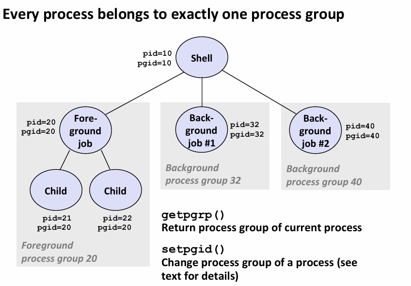
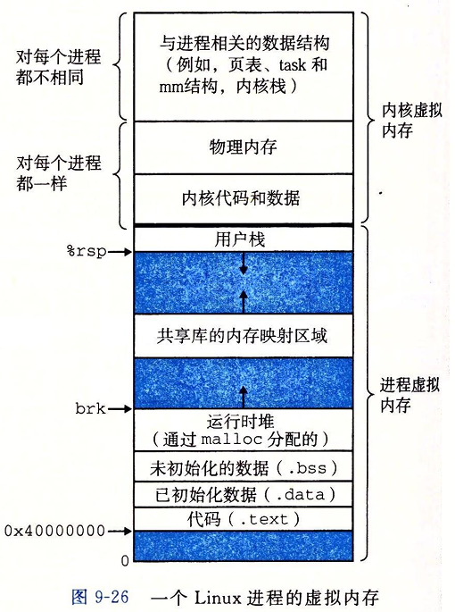

# Lab6 ShellLab
## 实验准备
- 实验介绍：利用学习的异常控制流机制（进程控制、信号），实现一个 tiny shell。
- 实验获取：https://csapp.cs.cmu.edu/3e/shlab-handout.tar，下载压缩包后，在linux环境使用`tar -xvf shlab-handout.tar`进行解压即可。
- 知识准备：学习教材第8章：异常控制流，尤其是理解其中的示例代码；阅读实验的Writeup, 它会告诉你这个实验如何完成。
- 实验环境：实验可在 WSL2 的 linux 环境运行。VSCODE 作为代码编辑器，通过 SSH 连接到 WSL2。
- 程序运行：解压tar包后，发现这是一个经典的C语言项目结构。你需要在`tsh.c`文件中写代码实现空缺的功能，**每次在`tsh.c`修改代码后，皆需要使用`make`命令进行编译**，以生成新的可执行程序`tsh`，在terminal输入`./tsh`就能运行我们自己的shell了。
- 程序测试：一共16个测试，输入`make test01`,`make test02`,...,`make test16`分别运行这16个测试。每个测试都有参考答案：输入`make rtest01`,`make rtest02`,...,`make rtest16`获得16个测试的参考答案。你需要保证运行16个测试的输出和参考答案完全一致（仅进程编号可以不同）。
## 基础知识整理
- 异常控制流这章内容繁多复杂，且教材中的很多示例代码就是直接可以复制过来用的，可以在实验初期为你形成基本框架，故在此对实验相关的基础知识及示例代码进行梳理。
### 进程
0. **操作系统：** 可以理解为躺在RAM（运行内存）中的内核代码。操作系统分为用户态（CPU执行用户的代码，权限较低）和内核态（CPU执行OS内核代码，权限很高）。操作系统会频繁切换用户态和内核态，以实现中断处理、异常处理、进程调度等功能。粗略地讲，进程（Process）指的是正在运行的程序。在操作系统中，以Android为例，你会打开微信、淘宝、Google等APP，每个APP可以视作一个正在运行的程序，那么每个APP就是一个进程。
1. **进程调度：** 操作系统有大量进程，比如进程A，进程B，进程C...，但是CPU核心数是有限的（此处以单核为例，单核CPU同一时刻只能运行单个进程），为了给用户一种“很多程序在同时流畅运行”的错觉，操作系统内核会实现进程调度，可以快速切换执行不同的进程：先做会儿A，然后做会儿B，再做会儿C，再做会儿B，再做会儿A...
2. **进程上下文切换：** 操作系统中会有多个进程，CPU每隔一段时间触发timer interrupt，从正在CPU上执行的进程中夺回CPU的控制权，CPU陷入内核开始执行操作系统内核代码，内核选择一个新进程（可能和刚刚执行的进程一致），恢复它的运行环境（恢复该进程保存的寄存器，并切换到该进程的页表），然后将CPU控制权交给这个新的用户进程，以实现进程调度。
3. **进程的三种状态：** Running, Stopped, Terminated。Running表示进程正在CPU上执行或者进程是就绪(Runnable)可以被调度的状态。Stopped表示进程被挂起。Terminated表示进程终止，终止分为正常终止和异常终止，正常终止包括：main函数执行完后返回、调用exit；异常终止：接收信号，且进程对该信号的默认行为是终止进程。
### fork 系统调用
1. 通过 fork 系统调用，父进程可以创建一个状态为Running的子进程。
2. 通过 fork 创建的子进程和父进程几乎一致：①子进程和父进程的虚拟地址空间是一致的（但是两个进程的地址空间是相互独立的）；②子进程拷贝父进程的文件描述符。③子进程的pid与父进程不同。
3. fork 调用一次，返回两次，在子进程和父进程分别返回一次。在子进程中，fork 返回 0，在父进程中，fork 返回子进程的 pid。根据fork返回值的差异性，可通过if语句控制父子进程的不同行为。于是有以下经典代码：
```c
int main() {
    pid_t pid;
    int x = 1;
    pid = Fork(); 
    if (pid == 0) {  /* Child */
        printf("child : x=%d\n", ++x); 
        exit(0);
    }
    /* Parent */
    printf("parent: x=%d\n", --x); 
    exit(0);
}
```
### 子进程的回收(Reap)
1. 进程终止后,变为僵尸进程，它依然会占用一些系统资源：①内核进程表条目(每个条目是一个PCB进程控制块结构体)，②进程号pid资源。在一个三年重启一次的服务器中，如果存在持续运行、一直创建进程而不回收进程的垃圾程序，将会造成严重的内存泄露。未回收的进程会占几KB的PCB结构体内存，且始终占用进程号pid。几KB的PCB结构体可能不会造成太大影响，但是占用进程号pid是个很严重的问题，linux系统可能仅支持2^15个进程号，一旦pid耗尽，系统就会报错 No more processes，此时你连执行个 ls 命令都执行不了，整台服务器直接瘫痪。
```c
/* 简化版 PCB(process control block) 块的结构。Simplified representation of 
   the task_struct structure in Linux kernel */
struct task_struct {
    volatile long state;            // Process state (e.g., TASK_RUNNING, TASK_STOPPED, EXIT_ZOMBIE)
    struct thread_info *thread_info;
    struct exec_domain *exec_domain; // Execution domain information (deprecated)
    struct mm_struct *mm;           // Memory management information (address space)
    struct fs_struct *fs;           // Filesystem information
    struct files_struct *files;     // File descriptor table
    struct signal_struct *signal;   // Signal handlers and signals pending
    struct sighand_struct *sighand; // Signal handling information
    ...
    /* Various other fields */
    ...
};
```
2. 回收：父进程使用`wait`或者`waitpid`即可回收子进程。父进程调用wait/waitpid函数只能回收自己的儿子进程(父进程通过`fork/vfork/clone`创建的进程)，孙子进程也是无法回收的。waitpid如果第一个参数指定的pid与调用waitpid的进程非父子关系，系统将会报错。
3. 孤儿进程：父进程终止了而没有回收它的子进程，会使得子进程变为孤儿进程，孤儿进程将会被系统的init进程回收。然而，有些父进程持续运行但是不回收子进程，这会导致子进程无法变成孤儿进程，从而子进程运行结束后一直作为僵尸进程存在，最终造成内存泄露。
### execve 函数
- 加载并运行程序。进程执行该函数后，进程的内存空间将直接被新的可执行程序覆盖，变得焕然一新。函数原型如下：
```
int execve(char *filename, char *argv[], char *envp[]) 
```
- 假设我们使用execve达到命令`/bin/ls –lt /usr/include`的运行效果，你需要填入的参数如下：
```c
char* filename = "/bin/ls";
//! \note execve 两个指针数组的传参皆需以 NULL 作为最后一个元素，从而界定数组的访问边界。
const char* argv[] = {"/bin/ls", "-lt", "/usr/include", NULL};
const char* envp[] = {"PWD=/usr/droh",...,"USER=droh", NULL}; // 如果不想填这个envp，可以直接 envp == NULL。
```
- 上述代码中，/bin/ls 就是一个可执行程序文件。一般而言，filename 和 argv[0] 相等，但二者可以不相等。比如 filename == "/bin/ls"，但是 argv[0] == "hello_world"。此时程序仍然执行 ls，但 ls 程序内部看到自己的名字会是：hello_world。
- execve 这个系统调用不返回，只有执行出错才会返回。
- linux 的 bash 需要用到 execve。比如你在命令行敲击 ls 按下回车，bash 会先通过 fork 创建子进程，然后调用`execve("/bin/ls", NULL, NULL)`加载并运行Linux系统的ls程序(ls是一个可执行文件，路径是/bin/ls)。大致代码如下所示。
```c
  if ((pid = Fork()) == 0) {   /* Child runs program */                                               
      if (execve(myargv[0], myargv, environ) < 0) {                                                        
          printf("%s: Command not found.\n", myargv[0]);                                                 
          exit(1);                                                                                     
      }                                                                                                
  }  
```
### shell
- shell就是你在linux系统中敲击命令按回车的那个黑框。用户通过 shell 与操作系统交互，从而运行用户进程。linux 系统的默认 Shell 是 bash。
- 下面是CSAPP教材实现的simple shell。实现逻辑很朴素：shell程序是一个无限循环，每次读取用户的一行输入，解析用户的输入，分为内置命令和非内置命令，若是非内置命令，就需要fork+execve创建子进程执行。对于非内置命令，若前台执行，则shell需要等待子进程执行完成并回收子进程，在此期间shell阻塞无法读取用户输入；若是后台命令，shell进程直接从eval返回，读取下一个用户输入。
- 然而，这个simple shell并没有回收后台子进程，由于shell进程一直运行使得后台子进程无法成为孤儿进程，这将会导致内存泄露。如何解决这个问题？你需要**信号**机制。
```c
int main() {
    char cmdline[MAXLINE]; /* command line */
    while (1) {
        printf("> ");
        Fgets(cmdline, MAXLINE, stdin);
        if (feof(stdin))
            exit(0);
        eval(cmdline); // evaluate
    }
}

void eval(char *cmdline) {
    char *argv[MAXARGS]; /* Argument list execve() */
    char buf[MAXLINE];   /* Holds modified command line */
    int bg;              /* Should the job run in bg or fg? */
    pid_t pid;           /* Process id */
    strcpy(buf, cmdline);
    bg = parseline(buf, argv);
    if (argv[0] == NULL)
        return;   /* Ignore empty lines */
    if (!builtin_command(argv)) {
        if ((pid = Fork()) == 0) {   /* Child runs user job */
            if (execve(argv[0], argv, environ) < 0) {
                printf("%s: Command not found.\n", argv[0]);
                exit(0);
            }
        }
        /* Parent waits for foreground job to terminate */
        if (!bg) {
            int status;
            if (waitpid(pid, &status, 0) < 0)
                unix_error("waitfg: waitpid error");
        } else {
            printf("%d %s", pid, cmdline);
        }
    }
    return;
}
```
### 进程组
- 每个进程都有一个进程id(记作pid)。而每个进程都属于且仅属于一个进程组(记作pgid)。
- 一般而言，通过shell启动的用户进程，其`pgid == pid`。若该用户进程继续fork子进程（子进程进一步fork孙子进程），那么fork出的子进程、孙进程和这个用户进程皆属于同一个进程组，他们的pgid是相同的。

### 信号(Signal)的概念
- 一个信号就是一条小消息，它通知进程系统中发生了一个某种类型的事件。它由操作系统内核向进程发送。信号用id表示不同的信号类型，id是用小整数来表示的(数字1~30)。一条信号携带的信息：①信号id；②信号到达的事实。
- 下表列出了一些常见的信号
| ID | 信号名称 (Name) | 默认动作 (Default Action) | 对应事件 (Corresponding Event) |
| :---: | :--- | :--- | :--- |
| **2** | SIGINT | 终止 (Terminate) | 用户输入了 `ctrl-c` |
| **11** | SIGSEGV | 终止并转储 (Terminate & Dump) | 段错误 / 内存段违规访问 (Segmentation violation) |
| **17** | SIGCHLD | 忽略 (Ignore) | 子进程停止或终止 (Child stopped or terminated) |
- 信号从发出到接收需要经历三个阶段：发送信号(Sending Singal) --> 挂起信号(Pending Signal) --> 接收信号(Receiving Signal)
### 发送信号
- 内核有多种方式向进程发送信号。
- 方式一：一些系统事件发生：①用户进程除以0会导致CPU触发硬件异常使得用户进程陷入内核，内核向这个尝试除以0的用户进程发送SIGFPE信号；②父进程fork出的子进程终止了，内核会向父进程发送SIGCHLD信号。
- 方式二：用户键盘输入。比如用户在进程前台执行时按下Ctrl+C，会发送SIGINT信号给前台进程组。
- 方式三：kill函数/命令，它只是发信号的，未必杀死进程。C语言提供了kill系统调用，linux 中也内置了 /bin/kill 可执行程序，通过指定发送信号的id和目标进程的pid，即可向特定进程发送信号。下面是一些调用示例(目标pid > 0 是发给单个进程，pid < 0 是发给进程组)：
```bash
kill –9 24818 # 向进程24818(pid == 24818)发送id = 9的信号(SIGKILL)
kill -9 -24818 # 向进程组24818(pgid == 24818)的所有进程发送id = 9的信号(SIGKILL)
```
```c
#define	SIGINT 2
kill(24818, SIGINT); // 向进程24818(pid == 24818)发送 SIGINT 信号
kill(-24818, SIGINT); // 向进程组24818(pgid == 24818)的所有进程发送 SIGINT 信号
```
### 挂起信号（待处理信号）
- 待处理信号：信号已经由内核发出，但是目标进程还没有接收（目标进程未对该信号做出反应）。
- 进程上下文会用pending这个bit vector记录待处理信号。当类型为k的信号发送给进程p时，内核会在该进程pending的第k比特位设置为1。由于每个信号是否处于待处理状态是由单个比特位记录的，只能记录0/1，所以**同类型信号至多记录一个待处理信号**，多个同类型待处理信号不会排队等待。例如：若进程p的pending记录了SIGINT信号，内核又向进程p发送了2个SIGINT信号，此时这两个SIGINT信号会被丢弃。
- 进程可以阻塞接收某些类型的信号。进程上下文通过blocked这个bit vector记录阻塞信号。可通过C语言的`sigprocmask`函数设置阻塞哪些信号。
- pending中记录的待处理信号只能被接收一次，即：一旦进程对这个信号做出反应，pending队列中对该信号的记录就会被删去。
### 接收信号
- 当目标进程被内核强迫以某种方式对信号的发送做出反应时，它就接收了信号。
- 进程p接收的信号是**待处理且未被阻塞的信号**，即：`pnb = pending & ~blocked` 
- 进程可以做出的反应：①执行默认行为（忽略信号、终止进程、暂停进程）；②执行自定义的信号处理函数signal_handler（也叫捕获信号）。
- 进程p接收信号的时机（进程做出反应的时机）是：内核的异常处理代码执行完毕，将控制权交给进程p之前。这里的异常处理代码包括：执行系统调用、处理时钟中断（可能触发进程调度，导致上下文切换）、处理IO中断、处理缺页异常、处理除以0异常等。
- 接收信号算法的简化版代码如下：
```c
int get_signal(struct ksignal *ksig)
{
    struct task_struct *tsk = current;
    int sig;

    // Loop through the signal queue until we find a signal to deliver to user space
    for (;;) {
        // 1. Fetch the next unblocked signal pending for this thread/process
        sig = dequeue_signal(tsk, &tsk->blocked, &ksig->info);
        if (sig <= 0)
            return 0; // No pending signals remaining

        // 2. Handle tracing/debugging hooks (e.g., ptrace interception)
        if (unlikely(tsk->ptrace) && ptrace_signal_deliver(sig, ksig)) {
            continue; // Tracer might skip or change the signal
        }

        // 3. Extract the registered disposition (action) for this signal
        ksig->ka = tsk->sighand->action[sig - 1];

        // 4. Case A: The process explicitly requested to ignore this signal
        if (ksig->ka.sa.sa_handler == SIG_IGN) {
            continue; // Drop the signal and fetch the next one
        }

        // 5. Case B: The disposition is set to the default system action
        if (ksig->ka.sa.sa_handler == SIG_DFL) {
            
            // Check default behavior based on standard POSIX specifications
            if (sig_kernel_ignore(sig)) {
                continue; // Drop signal (e.g., default behavior for SIGCHLD/SIGURG)
            }

            if (sig_kernel_stop(sig)) {
                // Halt execution (e.g., SIGSTOP or Ctrl+Z SIGTSTP)
                do_signal_stop(sig);
                continue; // Resume iteration once the process wakes up
            }

            // Severe default actions: Process must terminate (e.g., SIGKILL, SIGSEGV)
            if (sig_kernel_coredump(sig)) {
                // Generate a core dump file before exiting
                do_coredump(&ksig->info);
            }
            
            // Terminate the execution of the entire thread group
            do_group_exit(sig); 
            return 0; 
        }

        // 6. Case C: A valid custom user-space handler exists!
        // Store the signal number and return 1 to inform the architecture code
        //! \note 只要执行用户的 signal handler，这个 get_signal 函数就跳出循环而结束执行了
        ksig->sig = sig;
        return 1; 
    }
}
```
- 信号嵌套执行：假设某进程对信号A和信号B皆设置了signal handler（即：该进程捕获了信号A和信号B）。某个进程在执行信号A的 signal handler 时，该进程处于用户态。若进程执行信号A的 signal handler 时，某次从内核态返回用户态的过程中，内核(执行`get_signal`的过程中)发现该进程有待处理信号B（假设该信号未被屏蔽）且存在signal handler，于是`get_signal`返回1，系统将为执行信号B的 signal handler 准备用户栈。这就发生了信号的嵌套执行。

### 信号的阻塞和解除阻塞
- 隐式阻塞（即：某些情况下会自动阻塞）。当执行信号A的handler时，该进程会阻塞接收信号A。例如：若执行信号A的过程中又收到信号A，那么信号A会在pending队列里面，但是由于blocked队列里面也有信号A,所以信号A不会被接收。
- 显式阻塞：`sigpromask`函数，与之相关的数据结构是信号集`sigset_t`。
- C语言没有集合类型，所以它提供了`sigemptyset`（清空信号集的所有信号，使之变为空集）、`sigfillset`（将所有信号添加到信号集，一般用于阻塞全部信号）、`sigaddset`（向信号集添加某个信号）、`sigdelset`（删除信号集中的某个信号）四个函数帮你操作信号集`sigset_t`。
- 下面是教材中的使用示例：
```c
sigset_t mask, prev_mask;
Sigemptyset(&mask);
Sigaddset(&mask, SIGINT);
/* Block SIGINT and save previous blocked set */
/* SIG_BLOCK: 将 mask 参数包含的信号和进程既有的阻塞的信号取并集 */
/* 第三个参数 prev_mask 用于储存进程原来的阻塞信号集，若传入 NULL，表示无需保留进程原来的阻塞信号集 */
Sigprocmask(SIG_BLOCK, &mask, &prev_mask);
/* Code region that will not be interrupted by SIGINT */
/* Restore previous blocked set, unblocking SIGINT */
/* SIG_SETMASK: 将 mask 参数包含的信号直接覆盖进程既有的阻塞信号集 */
Sigprocmask(SIG_SETMASK, &prev_mask, NULL);
```
### 安全信号处理
- 由于同一进程的**信号处理函数与用户程序、信号处理函数之间**皆为并发运行关系，可能造成类似于多线程环境那样的数据同步问题。如何写出安全的 signal handler？CSAPP列出了6条指引。
```
G0：信号处理程序尽可能简单。
G1：信号处理程序只调用 async-signal-safe 函数，即使发生异步信号递送导致函数执行被中断或重入，其行为仍然是安全的（如 write、_exit、sigprocmask、kill 等）。
G2：保存和恢复errno。若信号处理程序直接exit而非return，则无需该操作。
G3：访问（读/写）共享数据时暂时屏蔽所有信号（类似于多线程访问共享数据时加锁）。注意：实际工程中，为了减少不必要的影响，往往只阻塞可能访问该共享数据的相关信号，而不是无条件阻塞所有信号。
G4：全局变量声明为 volatile。防止程序只读取全局变量的寄存器副本而导致看不到最新值。
G5：全局标志(比如信号处理程序设置全局变量 flag = 1 表示收到了信号)声明为 volatile sig_atomic_t。可以保证对flag的读、写是原子的。当然，flag++和flag+=10这种依然不是原子的，它们涉及多条指令。
```
### 可移植信号处理
- 你的信号处理程序可能应用于不同版本的系统。一些系统的信号处理可能存在的问题是：①在执行某个信号A的handler后就会将信号A的接收方式恢复默认；②一些慢系统调用(比如 accept)会被信号处理中断，信号处理返回后，这些慢系统调用将停止执行并立即返回给用户错误条件。③处理信号时，不自动阻塞接收这个信号。
- 一般而言，使用下面的封装函数实现可移植信号处理。
```c
handler_t *Signal(int signum, handler_t *handler) {
    struct sigaction action, old_action;
    action.sa_handler = handler;
    // sigemptyset表示除了默认临时屏蔽handler对应的信号本身外，不额外屏蔽任何信号
    sigemptyset(&action.sa_mask); /* Block sigs of type being handled */
    action.sa_flags = SA_RESTART; /* Restart syscalls if possible */
    if (sigaction(signum, &action, &old_action) < 0)
        unix_error("Signal error");
    return (old_action.sa_handler);
}
```
### 信号处理函数的同步问题
- 下面的案例，如果fork后，子进程先执行，并且在父进程能再次运行之前，子进程就终止了，使得内核向父进程发送SIGCHLD信号。当内核计划调度父进程执行，准备从内核态返回用户态的过程中，发现父进程有未处理的SIGCHLD信号。于是，父进程会先执行hanlder的`deletejob`，而`addjob`则会靠后执行，从而导致逻辑错误。
```c
int main(int argc, char **argv) {
    int pid;
    sigset_t mask_all, prev_all;
    Sigfillset(&mask_all);
    Signal(SIGCHLD, handler);
    initjobs(); /* Initialize the job list */
    while (1) {
        if ((pid = Fork()) == 0) { /* Child */
            Execve("/bin/date", argv, NULL);
        }
        Sigprocmask(SIG_BLOCK, &mask_all, &prev_all); /* Parent */
        addjob(pid);  /* Add the child to the job list */
        Sigprocmask(SIG_SETMASK, &prev_all, NULL);
    }
}

void handler(int sig) {
    int olderrno = errno;
    sigset_t mask_all, prev_all;
    pid_t pid;
    Sigfillset(&mask_all);
    while ((pid = waitpid(-1, NULL, 0)) > 0) { /* Reap child */
        Sigprocmask(SIG_BLOCK, &mask_all, &prev_all);
        deletejob(pid); /* Delete the child from the job list */
        Sigprocmask(SIG_SETMASK, &prev_all, NULL);
    }
    if (errno != ECHILD)
        Sio_error("waitpid error");
    errno = olderrno;
}
```
- 为了避免这个问题，main函数在fork调用前，先阻塞SIGCHLD信号。父进程直到addjob执行完毕，再解除阻塞SIGCHLD。同时，由于子进程会复制父进程的信号阻塞列表，因此，子进程需要尽早解除对SIGCHLD的阻塞。
```c
int main(int argc, char **argv) {
    int pid;
    sigset_t mask_all, mask_one, prev_one;
    Sigfillset(&mask_all);
    Sigemptyset(&mask_one);
    Sigaddset(&mask_one, SIGCHLD);
    Signal(SIGCHLD, handler);
    initjobs(); /* Initialize the job list */
    while (1) {
        Sigprocmask(SIG_BLOCK, &mask_one, &prev_one); /* Block SIGCHLD */
        if ((pid = Fork()) == 0) { /* Child process */
            Sigprocmask(SIG_SETMASK, &prev_one, NULL); /* Unblock SIGCHLD */
            Execve("/bin/date", argv, NULL);
        }
        Sigprocmask(SIG_BLOCK, &mask_all, NULL); /* Parent process */
        addjob(pid);  /* Add the child to the job list */
        Sigprocmask(SIG_SETMASK, &prev_one, NULL);  /* Unblock SIGCHLD */
    }
    exit(0);
}
```
### 显式等待信号
- 下面的例子是主程序显式等待SIGCHLD的到达。这个程序是正确的，但是`while (!pid)`这种自旋操作会浪费CPU资源。
```c
volatile sig_atomic_t pid;
void sigchld_handler(int s) {
    int olderrno = errno;
    pid = Waitpid(-1, NULL, 0); /* Main is waiting for nonzero pid */
    errno = olderrno;
}

void sigint_handler(int s) {
}

int main(int argc, char **argv) {
    sigset_t mask, prev;
    Signal(SIGCHLD, sigchld_handler);
    Signal(SIGINT, sigint_handler);
    Sigemptyset(&mask);
    Sigaddset(&mask, SIGCHLD);
    while (1) {
        Sigprocmask(SIG_BLOCK, &mask, &prev); /* Block SIGCHLD */
        if (Fork() == 0) /* Child */
            exit(0);
        /* Parent */
        pid = 0;
        Sigprocmask(SIG_SETMASK, &prev, NULL); /* Unblock SIGCHLD */
        /* Wait for SIGCHLD to be received (wasteful!) */
        while (!pid);
        /* Do some work after receiving SIGCHLD */
        printf(".");
    }
    exit(0);
}
```
- 若将自旋语句改为`while (!pid) pause();`可能导致竞争条件：若程序在while测试之后和pause执行之前收到SIGCHLD信号执行sigchld_handler，则pause()无法再被SIGCHLD信号唤醒（除非用户手动按下Ctrl+C向主程序发送SIGINT信号）。
- 若将自旋语句改为`while (!pid) sleep(1);`逻辑上是对的，但问题是sleep多久？不好确定。
- 所以，为了显式等待信号，你需要`sigsuspend`：自旋语句将改为：`while (!pid) sigsuspend(&prev);`。修改后的`main`如下：
```c
int main(int argc, char **argv) {
    sigset_t mask, prev;
    Signal(SIGCHLD, sigchld_handler);
    Signal(SIGINT, sigint_handler);
    Sigemptyset(&mask);
    Sigaddset(&mask, SIGCHLD);
    while (1) {
        Sigprocmask(SIG_BLOCK, &mask, &prev); /* Block SIGCHLD */
        if (Fork() == 0) /* Child */
            exit(0);
        /* Parent */
        pid = 0; // 注意：pid = 0 下方删除了 Unblock SIGCHLD Sigprocmask(SIG_SETMASK, &prev, NULL); 
        /* Wait for SIGCHLD to be received */
        while (!pid)
            Sigsuspend(&prev);
        /* Do some work after receiving SIGCHLD */
        printf(".");
    }
    exit(0);
}
```
这里的`sigsuspend(&prev)`相当于原子化的（不会被打断的）下列语句，相当于延后解除对于SIGCHLD的阻塞。其中，`raw`为临时变量，用于在pause执行结束后恢复进程原有的阻塞信号集：
```c
sigprocmask(SIG_SETMASK, &prev, &raw); // prev 会解除对于 SIGCHLD 的阻塞
pause(); 
sigprocmask(SIG_SETMASK, &raw, NULL); // 恢复对 SIGCHLD 的阻塞
```
- 由于在即将执行pause()时才解除对SIGCHLD的阻塞，且解除SIGCHLD阻塞和调用pause()之间不会被打断。这就消除了竞争条件。
## 一些问题
### 前台进程组
- 前台进程组指的是可以直接与终端进行交互的进程组，即：只有前台进程组可以从终端（键盘）读取数据；当你按下Ctrl+C，Ctrl+Z，信号会发给（广播给）前台进程组；当后台进程试图读取终端输入，系统会向其发送 SIGTTIN 信号暂停这个后台进程。
- “前台进程组”不是一个一成不变的组织，它更像是一个麦克风。谁在舞台中央说话，终端就把麦克风（前台身份）递给谁的进程组。当你刚启动 Shell 时，Shell 所在的组握着麦克风，所以它们是同一个东西。
- 当你打开一个终端时，linux 的 bash 在前台进程组。我们运行`ps -o pid,pgid,tpgid,comm &`命令即可验证这一事实。从下文可以看出，bash, oh-my-posh（bash美化程序，用户自行安装的） 皆属于前台进程组 TPGID = PGID = 1551。
```
    PID    PGID   TPGID COMMAND
   1551    1551    1551 bash
   1714    1714    1551 ps
   1715    1551    1551 oh-my-posh
```
- 注意：如果上述命令不加 & 让ps后台运行的话，进程列表打印时，ps所在的进程组才是前台进程组。这个过程大概是：①bash 运行 fork 创建子进程(或者是job)；②子进程运行`setpgid(0, 0)`创建并加入新的进程组，这个进程组PGID和子进程的PID一致；③bash运行`tcsetpgrp(STDIN_FILENO, pgid)`将终端前台进程组切换给子进程。④job 结束后 shell 运行`tcsetpgrp(STDIN_FILENO, bash_pgid)`把自己重新设为 foreground process group。
```
    PID    PGID   TPGID COMMAND
   1551    1551    1678 bash
   1678    1678    1678 ps
```
- 同理，当你在bash中输入`./tsh`命令，`./tsh`所在进程组是前台进程组。然而，我们的`./tsh`不要求调用tcsetpgrp，这意味着tsh 始终待在前台进程组。
- writeup 中写明了调用 setpgid 的时机：After the fork, but before the execve, the child process should call setpgid(0, 0)。但是，子进程解SIGCHLD阻塞和setpgid的顺序应该是怎样的？下文给出了两种情况，到底要选哪一个？
```c
// new mask 只添加了 SIGCHLD 阻塞。
//! \note 方案1：先解除阻塞，再setpgid
sigprocmask(SIG_BLOCK, &new_mask, &old_mask);
pid = Fork();
if (!pid) {
    sigprocmask(SIG_SETMASK, &old_mask, NULL);
    setpgid(0, 0); 
    execve(argv[0], argv, NULL);
}
//! \note 方案2：先setpgid，再解除阻塞
sigprocmask(SIG_BLOCK, &new_mask, &old_mask);
pid = Fork();
if (!pid) {
    setpgid(0, 0); 
    sigprocmask(SIG_SETMASK, &old_mask, NULL);
    execve(argv[0], argv, NULL);
}
```
- 两种方案皆不会出现严重的问题。不过，选择方案2更好，即：子进程被创建后应当尽早设置进程组。若setpgid执行比较延迟，那么会出现一个窗口：从子进程创建到setpgid执行之间，子进程和tsh皆属于前台进程组，如果此时按下Ctrl+C，父子进程皆会收到这个信号（假设极端情况下，系统优先调度了父进程，将子进程添加到了jobs结构，且解除了父进程的信号阻塞，而子进程尚未执行setpgid），此时父进程执行sigint_handler的kill(-pid, SIGINT)时，编号为pid进程组可能不存在，从而使得kill函数执行出错。
### C语言字符串的存放位置
- 进程虚拟地址空间的数据区主要存放静态和全局变量，该区域由三个部分组成：.data段 .bss段 .rodata段。
1. .data段存放的是已经赋了初值、且初值不为 0 的全局变量和静态变量
2. .bss段存放的是未初始化，或者显式初始化为 0 的全局变量和静态变量。该段无需根据变量大小实际占据磁盘空间，只需要几个字节保存元数据，记录程序运行时.bss需要多少空间，以及.bss的权限。例如全局声明数组而不初始化：`int arr[10000000]; `，可执行文件中只会记录下列内容。
```
Name: .bss, Size: 40000000 Bytes, Flags: Allocate/Write
```
3. ./rodata段是只读数据段，存放程序运行期间不能被修改的常量。比如：字符串字面量(用双引号写的字符串，比如"hello")，全局常量(如 const int GLOBAL_VAR = 5;)。但是，函数内的const常量依旧会放在栈空间中，只有编译器会检查限制它不能被修改，若能骗过编译器检查，则你在运行时可以随便修改这个局部const常量。
- 情况1：p 指向的地址是字符串字面量 "hell word" 的地址，在 .rodata 段。若使用`p[1] = 'E'`尝试修改这个字符串，程序依然可正常编译生成可执行文件，则由于访问了只读数据，该可执行文件运行时会报错：Segmentation fault (core dumped)。
```c
int main(int argc, char** argv) {
    char* p = "hell word";
    return 0;
}
```
- 情况2：字符串常量池。现代编译器为了节约内存，通常有字符串常量重用机制。下面示例的两个字符串字面量完全一致，所以./rodata只保留一份这个字符串。
```c
int main(int argc, char** argv) {
    char *p1 = "hello world";
    char *p2 = "hello world";
    printf("%d\n", p1 == p2); // p1 == p2 is True
    return 0;
}
```
- 情况3：字符数组构成的字符串。下面的案例中，①编译期：字面量"hell word"会在./rodata中存储一份；②运行时：栈空间中会分配10个字节(包含`\0`)，把 .rodata 里的 "hello" 拷贝（复制）到栈空间。即："hell word"字符串存在两份，一份在只读数据段，另一份在栈空间。运行`str[1] = 'E'`这种修改语句是不会崩溃的，而是修改被拷贝到栈空间的字符串。
```c
int main(int argc, char** argv) {
    char str[] = "hell word";
    return 0;
}
```
- 情况4：字符串数组`char* arr[]`(C++是`std::string arr[];`)。例如下面的envp数组，"PWD=/usr/droh", "USER=droh"这俩字符串字面量会储存在./rodata段，但是不会向情况3那样将这些字符串拷贝到栈空间，栈空间的envp是一个指针数组，共3个元素，前两个元素是字符串字面量在./rodata的地址，第三个元素是0x0。
```c
int main(int argc, char** argv) {
    char* envp[] = {"PWD=/usr/droh", "USER=droh", NULL};
    return 0;
}
```
### linux捕获信号详解
0. CSAPP对内核地址空间的描述非常详尽，如下图所示。对于每个进程而言，它在内核地址空间有页表、`struct task` `struct mm`、内核栈。

1. 每个进程（假设进程是单线程的）有一个用户栈和一个内核栈。进程在执行过程中会陷入内核，CPU与内核入口代码(entry.S)会将被打断的用户进程的寄存器保存在内核栈中的`pt_regs`。`pt_regs`的结构如下所示。其中，`%rip %rsp`等寄存器是由CPU压入内核栈的，`%rdx %rdi...`是由内核入口代码entry.S压入的。
```
struct pt_regs {
    /* pushed by entry.S */
    unsigned long r15;
    unsigned long r14;
    unsigned long r13;
    unsigned long r12;
    unsigned long rbp;
    unsigned long rbx;
    unsigned long r11;
    unsigned long r10;
    unsigned long r9;
    unsigned long r8;
    unsigned long rcx;
    unsigned long rdx;
    unsigned long rsi;
    unsigned long rdi;

    /* System tracking */
    /* Original syscall number or hardware error code */
    unsigned long orig_ax; 

    /* pushed by hardware (or synthesized) */
    unsigned long rip;
    unsigned long cs;
    unsigned long eflags;
    unsigned long rsp;
    unsigned long ss;
};
```
2. 当操作系统从内核态返回用户态的过程中，对应进程的内核栈将被清空（通过增加内核栈指针的值来释放内核栈空间），内核栈中保存的寄存器从栈中弹出，恢复到CPU的物理寄存器上，为继续执行中断的用户进程恢复环境。
3. 若某次从内核态返回用户态的过程中，内核执行`get_signal`并发现有可捕获的信号A，那么内核会在用户栈构造`rt_sigframe`，其结构如下所示。内核栈的`pt_regs`会被拷贝到用户栈的`rt_sigframe->ucontext`当中，因为后续会修改内核栈上保存寄存器的值。随后，内核代码会修改内核栈中保存的`pt_regs->rip`的值，使它指向信号A的 signal handler 的地址。
```c
struct rt_sigframe {
    char __user *pretcode;              /* 信号蹦床（Trampoline）代码的返回地址 */
    struct siginfo info;                /* 包含信号的详细信息（如信号编号、发送者 PID 等） */
    struct ucontext uc;                 /* 用户态上下文，包含核心的寄存器备份 */
    struct fxregs_state fpstate;        /* 浮点寄存器、FPU/MMX/SSE 等扩展状态的备份（可选） */
    /* 在现代内核中，fpstate 可能作为 uc.uc_mcontext.fpstate 的指针指向这里 */
};
```
4. 内核代码通过CPU物理寄存器`%rdi`传参`signum`，作为 signal handler 函数的参数。`rt_sigframe`可以理解为一个特殊的函数栈帧，栈顶（栈的最低地址）是rt_sigframe的第一个数据成员`char __user *pretcode; `，它指向一段蹦床代码(Trampoline Code)，如下所示，这段蹦床代码包含系统调用`__NR_rt_sigreturn`。此外，由于用户栈有更新，那么储存在内核栈的`pt_regs->rsp`将更新为新的用户栈栈顶地址（指向`sigreturn addr`在用户栈的地址）。
```asm
__restore_rt:
    movq $15, %rax      # 15 是 __NR_rt_sigreturn 的系统调用号
    syscall             # 触发系统调用，陷入内核
    retq                # 理论上不会执行到这里，因为内核在恢复后会直接跳转到原程序的 rip
```
5. 操作系统从内核态返回用户态，该进程内核栈中保存的寄存器恢复到CPU物理寄存器中，并通过移动内核栈指针以逻辑清空内核栈。CPU在用户态，像执行一个用户函数调用那样在用户栈执行信号A的signal handler。
6. 在信号A的signal handler执行`ret`后，位于用户栈顶的`char __user *pretcode`被赋值给`%rip`，运行蹦床代码触发`__NR_rt_sigreturn`系统调用而陷入内核，该系统调用会将用户栈中保存的用户态寄存器`rt_sigframe->ucontext`拷贝到内核栈的`pt_regs`。（注意到：`pt_regs->rsp`会指向用户进程中断时的用户栈顶，相当于逻辑释放了由于接收、捕获信号而占用的用户栈空间）。
7. 最后，若没有其他信号，操作系统从内核态返回至用户态，将内核栈空间的寄存器恢复到CPU物理内存，用户进程继续执行，好像什么都没有发生过。